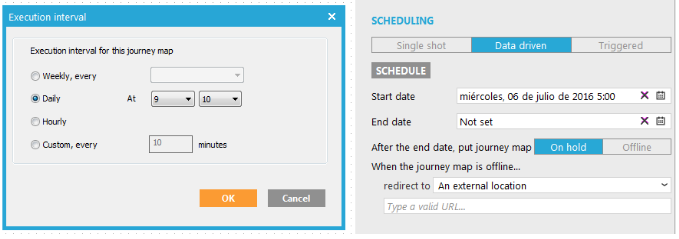

= Journey Map

Los journey Maps son los encargados de realizar los envíos de los emails, pueden programarse desde la pestaña properties apartado scheduling, si queremos que el envío se realice a diario deberá estar en modo Data Driven, y programaremos que día queremos que empiece en start date y cada cuanto queremos que se envíe, entrando en la opción schedule.

Los journey maps que tenemos son muy sencillos y están compuestos de dos elementos, la lista de usuarios a los cuales vamos a enviar (audiencia) y el diseño que se va a enviar.

Haciendo doble clic en la audiencia en la pestaña general podemos seleccionar el action list que usaremos para el envío y los códigos del action list que activaran el envío, normalmente cada journey map solo tiene un código, por ejemplo el journey map encargado del envío de retail de offerum tiene el código OF_RETAIL , en la pestaña data deberemos elegir también la action list ya que nuestro email contiene datos que usa de la action list y es necesario marcarlo para que el diseño reciba esos datos.
